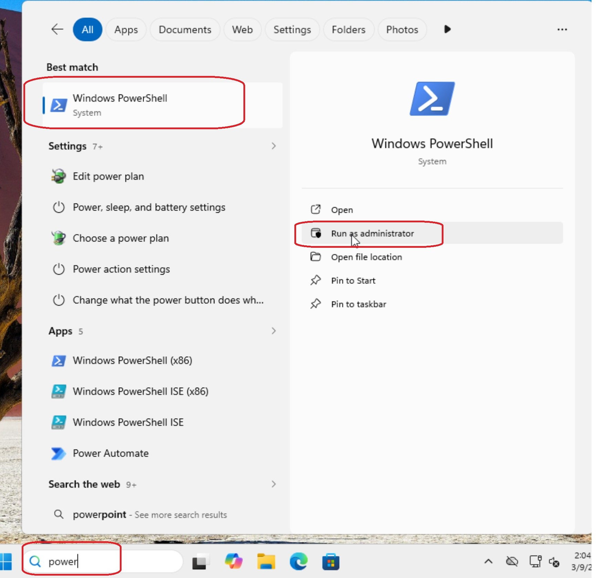
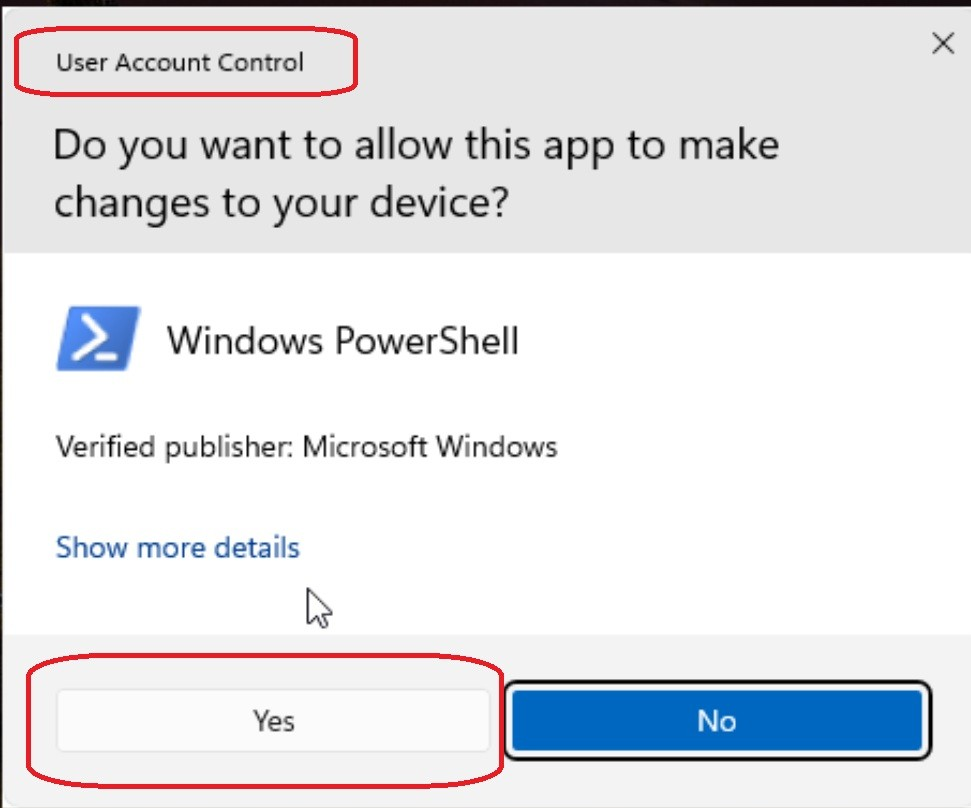
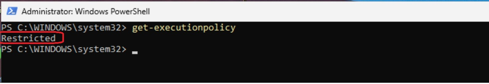
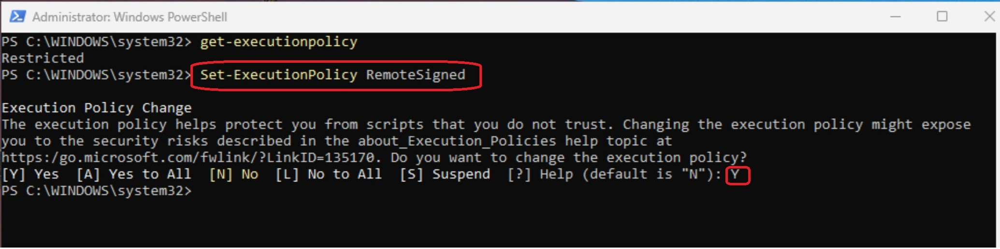
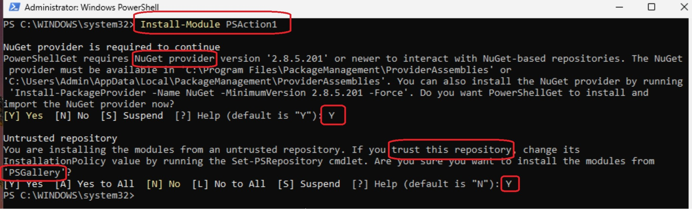
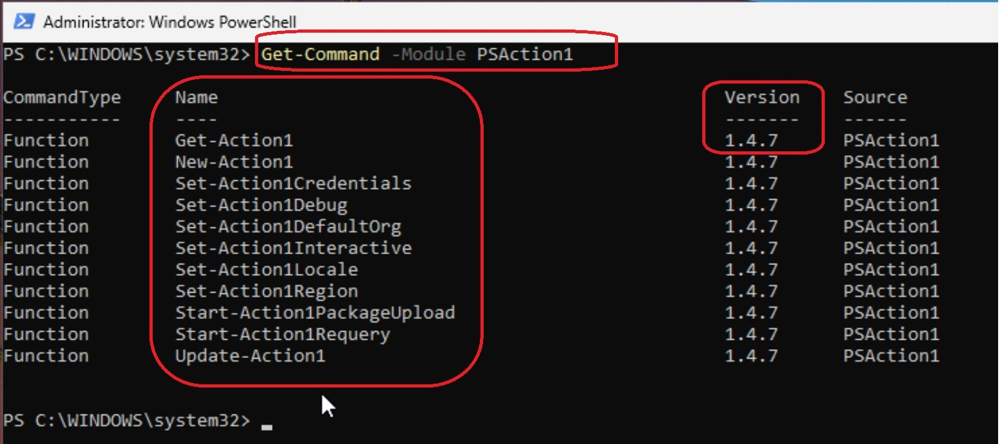
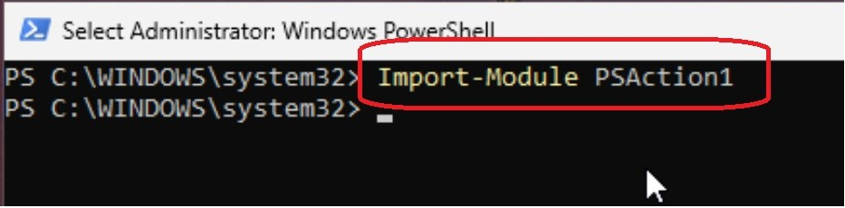



**Patch Management That Just Works**

[**First 200 endpoints are free, fully featured, forever.**](https://www.action1.com/free)

***

# PSAction1 - PowerShell interface to the Action1 API

:stop_sign: **IMPORTANT — READ CAREFULLY!** _The module with examples provided here are for convenience only.  While they have been prepared with care and tested for proper functionality, environments may vary. Before using in production, ensure you fully review, understand, and test the module in a non-production environment. You are responsible for verifying that it behaves as expected and does not cause any adverse effects.
By using this module, you acknowledge that you have read and accepted these conditions._

## Important Legal Notice

Use of all scripts, source code, binaries, installers, templates, dashboards, reports, integrations, connectors, containers, packages, documentation, and other materials in this repository is subject to [TERMS_OF_USE](./TERMS_OF_USE.md).

These materials may modify systems, install dependencies, connect to third-party services, transmit data, store credentials, create local databases, expose web interfaces, or otherwise impact production or non-production environments.

**Use at your own risk. Review the code. Test before production deployment.**

### Additional Notices

- [DISCLAIMER](./DISCLAIMER.md)
- [THIRD_PARTY_INTEGRATIONS](./THIRD_PARTY_INTEGRATIONS.md)
- [SECURITY_NOTICE](./SECURITY_NOTICE.md)
- [NOTICE](./NOTICE.md)
- [TERMS_OF_USE](./TERMS_OF_USE.md)

## Installation from PowerShell Gallery

 1. Run PowerShell console as the local machine **administrator**



 2. In the User Access Control (UAC) prompt, click **Yes** to allow the console operation. Microsoft is a trusted verified publisher.



 3. Check and update (if needed) PowerShell script execution policy - to ensure running PowerShell scripts is allowed on your machine:

```PowerShell

PS C:\> Get-ExecutionPolicy

```



```PowerShell

PS C:\> Set-ExecutionPolicy RemoteSigned

```



 4.  Install the **PSAction1** module

```PowerShell

PS C:\> Install-Module PSAction1

```

  * Agree to install or update the NuGet provider version required to install  packages from the PS Gallery

  * Add [PSGallery](https://www.PowerShellgallery.com) as a trusted PowerShell repository



  5. Verify that the module was installed successfully

```PowerShell

PS C:\> Get-command -module PSAction1

```



 6. Import the module PSAction1 (optional; import is performed automatically on running any PowerShell command from the installed module).

```PowerShell

PS C:\> Import-Module PSAction1

```



Once installed from the PowerShell gallery, this module will remain resident and does not have to be explicitly installed on each PowerShell console execution or machine reboot.

## Manual Installation

If you prefer to review the code prior to use, you can download the module and put it manually in your `$PSModulePath`.

Download the latest builds from GitHub, or use the [PowerShell Gallery](https://www.PowerShellgallery.com/packages/PSAction1) for the latest stable release.

Then import the module into your script's session:

```PowerShell

try {
    Import-Module PSAction1 -ErrorAction Stop
}
catch {
    Write-Error "Module PSAction1 is required"
    exit
}

Get-Action1

```

 This must be done on each execution of your script, so it is to place the import statement at the beginning of your script.

:stop_sign: **Important:**  _Code downloaded from GitHub may be under active development. For maximum stability, use the version from the PowerShell Gallery. Use development builds only if instructed by support or when troubleshooting specific issues._

## Getting started

Before you begin, you will need to understand the basics of how to authenticate to the Action1 API.

The getting started guide can be found here.

[https://www.action1.com/api-documentation](https://www.action1.com/api-documentation/api-credentials/)

Once you have followed the instructions to obtain an API key, you should have an "APIKey" (Client ID) value and "Secret" (Client Secret) value.

**You are now ready to get started, let's GO!**

## Using this module

The first step is to configure authentication. If required values are not provided in advance, the script will return an error indicating which values are missing.
Alternatively, you can enable interactive mode by running:

```PowerShell
  Set-Action1Interactive $true
```

This allows you to provide authentication details step by step.

- Authentication sessions have a timeout, which is handled automatically by  the module

- The PSAction1 module stores the bearer token and validates it  before use. If the token has expired, it will be renewed. This may introduce a very small delay , similar to the initial authentication, but the impact is minimal. When debug mode is turned on, you observe this process.

- Once authenticated, no further authentication is required for the duration of the session.

:stop_sign: **Important:**  _The values below are examples and DO NOT belong to a live instance. Replace them with your actual credentials._

```PowerShell
PS C:\> Set-Action1Region NorthAmerica # Choices are currently NorthAmerica, Europe and Australia. More regions coming soon.

PS C:\> Set-Action1Credentials -APIKey api-key-example_e0983b7c-45e8-4c82-9f98-b63bdc4dcb33@action1.com -Secret 652b47a18e212e695e9fbfaa

```

Next, you should set an organization context.

Each organization has a unique ID, which you can locate in the URL when you log in to Action1.

By default, most users have a single organization. If you are a Managed Service Provider (MSP) or have an enterprise with multiple entities, you can create multiple organizations to separate their data from each other.

https[]()://app.action1.com/console/dashboard?org=**88c8b425-871e-4ff6-9afc-00df8592c6db** <- This is your Org_ID

Like the APIKey and Secret, the organization ID is stored for the duration of the session. If not specified, you will be prompted when it is needed.

To switch to another organization, you should set a new context before performing additional actions. For that, run this command with the required Org_ID:

```PowerShell

PS C:\> Set-Action1DefaultOrg -Org_ID 88c8b425-871e-4ff6-9afc-00df8592c6db

```

  :stop_sign: **Important:**  _You can only operate in the context of one organization at a time._

### You are all set up, let's get started.

The module provides  five main commands:

  - **Get-Action1**

    - Retrieves data only; makes no changes to the actual instance.

  - **New-Action1**

    - Creates items and returns the new object.

  - **Set-Action1[KeyWord]**

    - Sets values within the module only; does not interact with server data directly.

  - **Update-Action1**

    - Used to modify or delete items.

  - **Start-Action1Requery**

    - Initiates a data refresh.


## Querying endpoints

To retrieve endpoint data, use this command:

```PowerShell

PS C:\> Get-Action1 -Query Endpoints | select -First 1
```

Example output:

```PowerShell
id                   : ef17c844-5b7c-4b32-9724-f2716b596639

type                 : Endpoint

self                 : https://app.action1.com/api/3.0/endpoints/managed/88c8b425-871e-4ff6-9afc-00df8592c6db/ef17c844-5b7c-4b32-9724-f2716b596639/general

status               : Connected

last_seen            : 2023-12-09_01-44-11

name                 : A1DEV

address              : 192.168.0.135

OS                   : Windows 11 (23H2)

platform             : Windows_64

agent_version        : 5.179.579.1

agent_install_date   : 2023-11-08_19-11-15

subscription_status  : Active

user                 : A1DEV\gmoody

comment              : None

device_name          :

MAC                  : 08:00:27:60:A8:9D

serial               : 0

reboot_required      : No

online_status        : UNDEFINED

AD_organization_unit :

AD_security_groups   : {}

CPU_name             : Intel(R) Core(TM) i7-1065G7 CPU @ 1.30GHz

CPU_size             : 1x1.5 GHz, 4/4 Cores

disk                 : 80Gb Generic

manufacturer         : innotek GmbH

NIC                  : Intel(R) PRO/1000 MT Desktop Adapter

video                : VirtualBox Graphics Adapter (WDDM), , 0Gb

WiFi                 :

RAM                  : 0Gb Unknown

last_boot_time       : 2023-12-08_22-12-38

update_status        : UNDEFINED

vulnerability_status : UNDEFINED

```

:left_speech_bubble: **Note:** _All endpoints  support custom attributes that can be set  directly for ID or Attribute, as in the example below._

```PowerShell

PS C:\>  Update-Action1 Modify CustomAttribute -Id 'ef17c844-5b7c-4b32-9724-f2716b596639' -AttributeName "Custom Attribute 1" -AttributeValue "test this"

```

### The list of additional query expressions:

 * AutomationInstances
 * Automations
 * AdvancedSettings
 * Apps
 * CustomAttribute
 * EndpointGroupMembers
 * EndpointGroups
 * Me
 * Endpoint
 * EndpointApps
 * Endpoints
 * Logs
 * MissingUpdates
 * Organizations
 * Packages
 * PackageVersions
 * Policy
 * Policies
 * PolicyResults
 * ReportData
 * ReportExport
 * Reports
 * Scripts
 * AgentDepoyment
 * Vulnerabilities
 * RawURI
 * Settings

:left_speech_bubble: **Note:** _Consider that some queries are plural, some are singular._

* Plural queries return a collection of items.

* Singular query targets an object by its **-ID**; if the object is not found, then NULL will be returned, and you will receive an error message indicating the specified ID could not be found.
* The **-Query** parameter is optional and can be omitted, as it is the first bound parameter.

  **Example:**

```PowerShell

PS C:\> Get-Action1 Endpoint -Id ef17c844-5b7c-4b32-9724-f2716b596639

```

## Next steps

1. Start by querying the groups to find one with the matching name.

2. (optional) Verify the group object visually.

3. Make a clone of that group object to  duplicate the group into an editable template.

4. (optional) Verify the cloned object.

5. Rename that group object, and then create a new group based on the modified data.

The newly created group object is returned with its ID and details.

:left_speech_bubble: **Note:** _Not all objects support creation and or cloning. The module will <s>inform you in these cases</s> notify you if an operation is not supported._

```PowerShell

PS C:\> $group = Get-Action1 EndpointGroups | ?{$_.name -eq 'Service'}

PS C:\> $group

id             : Service_1696554367754

type           : EndpointGroup

self           : https://app.action1.com/api/3.0/endpoints/groups/88c8b425-871e-4ff6-9afc-00df8592c6db/Service_1696554367754

name           : Service

description    :

include_filter :  {@{field_name=OS; field_value=Windows 10; mode=include}, @{field_name=name; field_value=A1DEV; mode=include}}

exclude_filter : {}

contents       : https://app.action1.com/api/3.0/endpoints/groups/88c8b425-871e-4ff6-9afc-00df8592c6db/Service_1696554367754/contents

uptime_alerts  : @{offline_alerts_enabled=no; offline_alerts_delay=10; online_alerts_enabled=no; user_ids_for_notification=System.Object[]}

PS C:\> $clone = Get-Action1 Settings -for EndpointGroup -Clone $group.id

PS C:\> $clone | Format-List

name           : Service

description    :

include_filter :  {@{field_name=OS; field_value=Windows 10; mode=include}, @{field_name=name; field_value=A1DEV; mode=include}}

exclude_filter : {}

PS C:\> $clone.name = "Some New Name"

PS C:\> $clone | Format-List

name           : Some New Name

description    :

include_filter :  {@{field_name=OS; field_value=Windows 10; mode=include}, @{field_name=name; field_value=A1DEV; mode=include}}

exclude_filter : {}

PS C:\> New-Action1 EndpointGroup -Data $clone

id             : Some_New_Name_1702095463270

type           : EndpointGroup

self           : https://app.action1.com/api/3.0/endpoints/groups/88c8b425-871e-4ff6-9afc-00df8592c6db/Some_New_Name_1702095463270

name           : Some New Name

description    :

include_filter :  {@{field_name=OS; field_value=Windows 10; mode=include}, @{field_name=name; field_value=A1DEV; mode=include}}

exclude_filter : {}

contents       : https://app.action1.com/api/3.0/endpoints/groups/88c8b425-871e-4ff6-9afc-00df8592c6db/Some_New_Name_1702095463270/contents

```

:left_speech_bubble: **Note:** _**-Clone**  accepts an Id as a parameter, so it implies **-Id**_

Once you understand how to query and create objects, the syntax for modifying them follows the same pattern and is performed using **Update-Action1**.

```PowerShell

PS C:\> $group = Get-Action1 EndpointGroups | ?{$_.name -eq 'Some New Name'}

PS C:\> $clone = Get-Action1 Settings -for EndpointGroup -Clone $group.id

PS C:\> $clone.name = "Some Other Name"

PS C:\> Update-Action1 Modify -Type EndpointGroup -Id $group.id -Data $clone

id             : Some_New_Name_1702095463270

type           : EndpointGroup

self           : https://app.action1.com/api/3.0/endpoints/groups/88c8b425-871e-4ff6-9afc-00df8592c6db/Some_New_Name_1702100718378

name           : Some Other Name

description    :

include_filter : {@{field_name=OS; field_value=Windows 10; mode=include}}

exclude_filter : {}

contents       : https://app.action1.com/api/3.0/endpoints/groups/88c8b425-871e-4ff6-9afc-00df8592c6db/Some_New_Name_1702100718378/contents

```

Cloning is useful when you have an object that closely matches your needs, and you want to tweak it for different purposes. You can create objects from scratch as well.

Both for **Clone**s and **New Setting**s, there are helper methods to add elements like include/exclude filters.


```PowerShell

PS C:\> $NewGroup = Get-Action1 Settings -For EndpointGroup

PS C:\> $NewGroup | Format-List

name           :

description    :

include_filter : {}

exclude_filter : {}

C:\> $NewGroup.Splat("MyNewGroup","The group I just Created")

name       description              include_filter exclude_filter

----       -----------              -------------- --------------

MyNewGroup The group I just Created {}             {}

PS C:\> $NewGroup.AddIncludeFilter('name','A1DEV','include')

PS C:\> New-Action1 EndpointGroup -Data $NewGroup

id             : MyNewGroup_1702147189271

type           : EndpointGroup

self           : https://app.action1.com/api/3.0/endpoints/groups/88c8b425-871e-4ff6-9afc-00df8592c6db/MyNewGroup_1702147189271

name           : MyNewGroup

description    : The group I just Created

include_filter : {@{field_value=A1DEV; field_name=name; mode=include}}

exclude_filter : {}

contents       : https://app.action1.com/api/3.0/endpoints/groups/88c8b425-871e-4ff6-9afc-00df8592c6db/MyNewGroup_1702147189271/contents

```

These helper methods are usually used to:
* manage group actions where more than one value is set at once
* handle object collections where multiple values must be set on one object and specific case/structure must be enforced
* perform bulk actions

The example below demonstrates all three scenarios, using an Automation clone.

In the example, we specify just the ID of the Endpoint or EndpointGroup, as the target type ("**Endpoint**" or "**EndpointGroup**") is implied by the method name.

The method ensures that the case-sensitive attributes and the JSON formatting, are created properly using ID as the only parameter.

**Clear** methods require no parameters as they imply an absolute action.

:left_speech_bubble: **Note:** _When using **Delete** methods, the identifier can be either the ID or the Name of the object to be removed. For example, in EndpointGroups 'Filters' are added by name, and in Automations 'Endpoints/EndpointGroups' they are added by ID._

**Example**

```PowerShell

PS C:\> $clone = get-Action1 Settings -For Automation -Clone PolicyStore_Do_this_thing_1699034505782

PS C:\> $clone.ClearEndpoints()

PS C:\> $clone.AddEndpoint('ef17c844-5b7c-4b32-9724-f2716b596639')

PS C:\> $clone.AddEndpointGroup('Service_1696554367754')

PS C:\> $clone

name          : Policy Store Do this thing

settings      : DISABLED

retry_minutes : 1440

endpoints     : {@{id=ef17c844-5b7c-4b32-9724-f2716b596639; type=Endpoint}, @{id=Service_1696554367754; type=EndpointGroup}}

actions       : {@{name=Run Command; template_id=run_script; params=; id=Run_Command_0d499d60-7a73-11ee-a574-3509a7afa959}}

PS C:\> $clone.DeleteEndpointGroup('Service_1696554367754')

PS C:\> $clone

name          : Policy Store Do this thing

settings      : DISABLED

retry_minutes : 1440

endpoints     : {@{id=ef17c844-5b7c-4b32-9724-f2716b596639; type=Endpoint}}

actions       : {@{name=Run Command; template_id=run_script; params=; id=Run_Command_0d499d60-7a73-11ee-a574-3509a7afa959}}

```

:left_speech_bubble: **Note:** _All of these actions are being performed on an in-memory object on the client side. None of these changes are actually committed to the server, until the object is passed as the **-Data** parameter to an execution of **Update-Action1** or **New-Action1**._

You can safely make, review, or discard changes without commitment, without affecting the server. Please get familiar with how these helper methods work before committing them to the server.
A good starting point is to create an object in the Action1 console, and then pull that object into **PSAction1**. Examine how the data comes structured in the system. Methods will format data following that pattern.


You can also delete objects. For example, you can target the clone created earlier.

Delete operations prompt for confirmation by default. You can use **-Force** overrides that behavior.

  :stop_sign: **Important:** _Deleting an object is irreversible. Use with caution when deleting, **ESPECIALLY** if utilizing the **-Force** option!_

```PowerShell

PS C:\> Update-Action1 Delete -Type Group -Id MyNewGroup_1702147189271 -Force

```

### Deploying patches and software packages

You can deploy both patches and software packages through PSAction1. Like other actions, this process starts by getting a settings template for the operation, adding relevant information about what you would like to deploy, and then creating a new object in Action1 to execute the task. In this case, the type of object created is a <i>policy instance</i>. This is a special type of automation that runs once on demand and does not leave a template in the Automations section inside Action1, but  can still be found in the automation history of any assigned endpoint.

 **Example:**  
 
 **Remediating a vulnerability**

When patching a vulnerability, it is identified by its CVS id.

The remediation process includes:

1. Getting a Remediation settings template
2. Adding one or more CVE’s to be addressed to it
3. Assigning it to one or more endpoint groups
4. Submitting the configuration to the server.

:left_speech_bubble: **Note:** _It is common for a single patch to address multiple CVEs. PSAction1 automatically detects when multiple CVEs are resolved by the same patch and avoids duplicating it in the deployment queue. As a result, you can safely add multiple CVEs. However, be aware that the patch will remediate **all** associated CVEs, not only the ones explicitly specified._

```Powershell

PS C:\> $push = Get-Action1 Settings -For Remediation

PS C:\> $push.AddCVE('CVE-2022-3775')

PS C:\> $push.AddEndpointGroup('Test_1720748341834')

PS C:\> New-Action1 Remediation -Data $push

```

Software packages get deployed in much the same way, they just require a package id, the script will automatically select the correct version as being the latest available for the package requested.

Software packages are following a similar process.

As with remediation, you can add one or more packages to the queue. Duplicate entries are automatically prevented. Helper methods are also available to assign endpoints and endpoint groups.

The workflow is as follows:
1. Retrieve a settings template.

2. Add one or more software packages.

3. Assign endpoints or endpoint groups.

4. Create a new policy instance in Action1 to initiate deployment.

As with remediation, this policy instance is a one-time automation. It appears in the endpoint’s automation history but is not listed in the Automations section of the Action1 console.

```Powershell

PS C:\> $data = Get-Action1 Settings -For DeploySoftware

PS C:\> $data.AddEndpoint('bfbd1da2-d746-44dc-9c87-89382bbd4c53')

PS C:\> $data.AddPackage('Martin_P_ikryl_WinSCP_1632062504985_builtin')   #ID of package from Get-Action1 Packages

PS C:\> New-Action1 DeploySoftware -Data $data

```

### Reporting

You can also retrieve report data using PSAction1. Reports can be returned as objects, allowing you to access and work with their properties as needed (for example, filtering, sorting, or exporting data).

```PowerShell

PS C:\> Get-Action1 ReportData -Id 'installed_software_1635264799139'

id              : ZDesigner%2520Windows%2520Printer%2520Driver%2520Version                                                                                                                                        type            : ReportRow                                                                                                                                                                                       self            : https://app.action1.com/api/3.0/reportdata/df137c59-f12a-03c6-7b7e-63701cb6eba3/installed_software_1635264799139/data/ZDesigner%2520Windows%2520Printer%2520Driver%2520Version

fields          : @{Name=ZDesigner Windows Printer Driver Version; Details=2}

drilldown_field : Details

drilldown       : https://app.action1.com/api/3.0/reportdata/df137c59-f12a-03c6-7b7e-63701cb6eba3/installed_software_1635264799139/data/ZDesigner%2520Windows%2520Printer%2520Driver%2520Version/drilldown

id              : Zebra%2520Font%2520Downloader

type            : ReportRow

self            : https://app.action1.com/api/3.0/reportdata/df137c59-f12a-03c6-7b7e-63701cb6eba3/installed_software_1635264799139/data/Zebra%2520Font%2520Downloader

fields          : @{Name=Zebra Font Downloader; Details=1}

drilldown_field : Details

drilldown       : https://app.action1.com/api/3.0/reportdata/df137c59-f12a-03c6-7b7e-63701cb6eba3/installed_software_1635264799139/data/Zebra%2520Font%2520Downloader/drilldown

```

This retrieves an object collection with the id and other details report objects. This is primarily useful for identifying the ID of the report for which you want to retrieve data.

Then you can use that id to pull the actual data in CSV format for integration with other systems.

```PowerShell

PS C:\> Get-Action1 ReportExport -Id 'installed_software_1635264799139'

Name,Details

ZDesigner Windows Printer Driver Version,2

Zebra Font Downloader,1
```

Finally, because report data is retrieved through polling, it may not always reflect the most up-to-date state at the exact moment of retrieval.

```PowerShell

PS C:\> Start-Action1Requery -Type InstalledSoftware

PS C:\> Start-Action1Requery -Type InstalledSoftware -Endpoint_Id 'ef17c844-5b7c-4b32-9724-f2716b596639'

```

These statements are non-blocking, meaning they initiate a re-query of the data, but the re-query is not instantaneous and can vary depending on your particular deployment. Therefore, an immediate attempt to export data again may or may not contain the complete information set from this request. After a period of  time,  the accuracy of the reported data for all reachable endpoints should improve .

- For **ReportData** and **InstalledSoftware**, these re-query actions can be performed at the endpoint level.
- For **InstaledUpdates**, re-query is performed system-wide.

:left_speech_bubble: **Note:** _Re-query requests are processed the next time an endpoint becomes available. Offline endpoints are not affected until they reconnect._

### Extending / testing / playground

This interface covers only the most commonly used API features. The underlying API provides significantly broader functionality.

You can use the PSAction1 authentication mechanism to run custom API requests  and explore additional capabilities. For that, you can use the **RawURI** method in **Get-Action1** command:

```PowerShell

PS C:\> Get-Action1 RawURI -URI https://app.action1.com/api/3.0/policies/schedules/88c8b425-871e-4ff6-9afc-00df8592c6db/PolicyStore_Do_this_thing_1699034505782

```

### Troubleshooting

 At any time you can enable and disable debug mode to get more information about operations and communication with the server. This is especially useful when looking at JSON POST/PATCH data going to the server.

```PowerShell

PS C:\> Set-Action1Debug $true

  Action1 Debug: Debugging enabled.

PS C:\> Set-Action1Debug $false

```

### And you can always reach out to the Action1 community via:

- [Discord](https://discord.com/channels/841428478669881356/841428479266258946)
- [Reddit](https://www.reddit.com/r/Action1/).

## WARNING: Carefully study the provided scripts and components before using them. Test in your non-production lab first.

